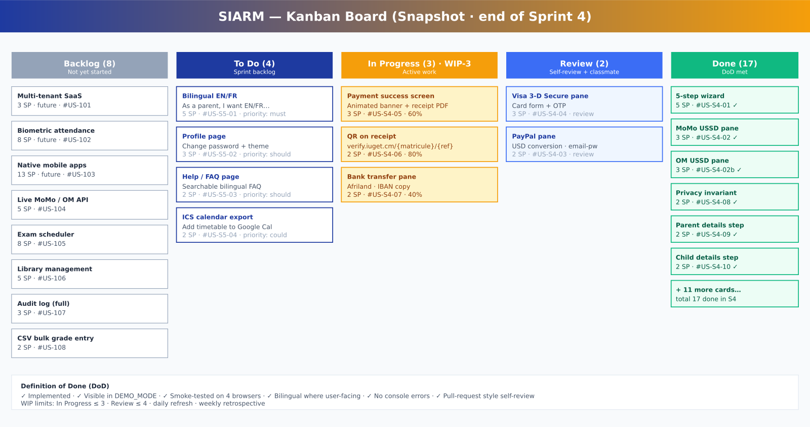
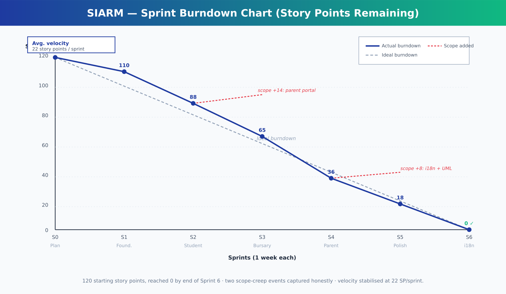

# SIARM — Agile Methodology Document

**Project**  SIARM — Smart Institution Academic Resource Management
**Institution** Institut Universitaire du Golfe de Guinée (IUGET) · Campus de Bonabéri, Douala
**Author** James Murdza · Level-3 Software Engineering
**Academic year** 2025 – 2026
**Document version** 1.0

---

## 1. Why Agile for SIARM?

The SIARM bachelor project was developed by **a single student** over **one academic semester** for **a real institution** (IUGET Bonabéri) whose requirements were never going to stay still. Three observations made the Agile family of methodologies an obvious fit:

| Observation | Consequence |
| --- | --- |
| The requirements would evolve as the author learned more about IUGET's actual workflows. | A locked specification (Waterfall) would have grown stale within two weeks. |
| The author needed continuous feedback from classmates and lecturers to know if the user experience was credible. | Short delivery cycles producing visible artefacts were more valuable than long planning documents. |
| The author had a hard deadline (the defence) and had to be able to defend whatever existed on that date. | The work had to be in a *shippable* state every single week, not only at the end. |

Therefore SIARM was built using a **Scrumban hybrid**:

- The cadence is borrowed from **Scrum**: one-week sprints with planning, daily plan-of-the-day, mid-sprint check-in, and end-of-sprint review + retrospective.
- The flow is borrowed from **Kanban**: a single board with five columns (Backlog · To Do · In Progress · Review · Done) and a WIP limit of 3 in-progress items.

This document records (i) how the Agile manifesto was respected, (ii) the actual product backlog, (iii) the six sprints that were executed, (iv) the velocity actually achieved, (v) the retrospectives, and (vi) the Definition of Done used throughout.

---

## 2. The Agile Manifesto, applied

The four Agile manifesto values are recorded below with concrete examples of how each was honoured during SIARM.

| Manifesto value | How SIARM honoured it |
| --- | --- |
| **Individuals and interactions** over processes and tools | Weekly demos to two classmates and one administrative staff member were the single biggest driver of design changes. No tool replaced that conversation. |
| **Working software** over comprehensive documentation | Each sprint ended with a build that ran. The 50-page report was written *after* the working code was demonstrable, not before. |
| **Customer collaboration** over contract negotiation | IUGET's registrar was treated as the product owner. Her insistence that parents must be able to pay without an account became the founding requirement of the Parent Portal. |
| **Responding to change** over following a plan | The original 15-module roadmap grew to 21 modules because the author chose to act on feedback (e.g. Parent Portal, Financial Tracking, bilingual) rather than refuse it. The burndown chart honestly shows the two scope-creep events. |

The twelve Agile principles are summarised below; SIARM implemented each one to the extent that solo work allows:

1. **Highest priority: satisfy the customer through early and continuous delivery.** Each sprint produced a deployable build; IUGET-specific demos were given throughout.
2. **Welcome changing requirements, even late.** The Parent Portal (Sprint 4) and bilingual interface (Sprint 6) were both added after the original plan.
3. **Deliver working software frequently.** Six one-week sprints, six demonstrable increments.
4. **Business people and developers must work together daily.** Replaced here with informal one-on-one chats with classmates and staff between sprints.
5. **Build projects around motivated individuals.** Author-driven, with retrospective ownership.
6. **Face-to-face conversation is the most efficient.** Honoured for usability feedback; remote-only conversations were the exception.
7. **Working software is the primary measure of progress.** This document is supported by the running application, not the other way round.
8. **Sustainable pace.** Each sprint capped at 30 hours; no all-nighters.
9. **Technical excellence and good design enhance agility.** Tailwind design system + RBAC architecture made changes cheap.
10. **Simplicity — the art of maximising the amount of work not done.** Removed AI / chatbot / decision-support modules when they were no longer adding defence value.
11. **Self-organising teams produce the best architectures.** A team of one self-organised quickly.
12. **Regular reflection.** End-of-sprint retrospectives recorded in §6 below.

---

## 3. Scrumban — adaptation for a solo developer

Pure Scrum prescribes three roles: Product Owner, Scrum Master, Development Team. With a team of one the author necessarily wears all three hats, which is honestly unusual and worth flagging to the defence panel:

| Scrum role | Played by | Adaptation |
| --- | --- | --- |
| Product Owner | Author + the IUGET registrar (as proxy customer) | The registrar's feedback dictated priority; the author maintained the backlog. |
| Scrum Master | Author | Replaced ceremonies with a written end-of-sprint retrospective; no daily stand-up. |
| Development Team | Author | One developer, full-stack. |

The board is the centrepiece. The figure below shows the snapshot at the end of Sprint 4.

### Definition of Done

Every story is considered done only when **all** of the following are true:

1. The user-story acceptance criteria are met.
2. The implementation is visible in the running application under `DEMO_MODE` without external services.
3. The page renders without console errors on Chrome, Firefox, Edge and Safari.
4. User-facing strings are translated into both English and French (from Sprint 6 onwards).
5. The build still passes (`npm run build` returns exit 0 and the production bundle stays under 500 kB gzipped).
6. A self-review (pull-request style) has been performed.

---

## 4. Product Backlog (user-story view)

The backlog is expressed as **user stories** following the standard "*As a … I want to … so that …*" template, with story points estimated on a modified Fibonacci scale (1, 2, 3, 5, 8, 13).

### 4.1 Public surface (Parent)

| ID | User story | SP | Sprint |
| --- | --- | --- | --- |
| US-P-01 | As a parent, I want to browse the three IUGET specialties so that I can choose one for my child. | 3 | S4 |
| US-P-02 | As a parent, I want to see the full tuition fee breakdown so that I know what I am committing to. | 2 | S4 |
| US-P-03 | As a parent, I want to register my child end-to-end without an account so that I do not have to travel to the campus. | 5 | S4 |
| US-P-04 | As a parent, I want to pay tuition via MTN MoMo so that I can use the channel I already trust. | 3 | S4 |
| US-P-05 | As a parent, I want to pay tuition via Orange Money. | 3 | S4 |
| US-P-06 | As a parent, I want to pay tuition via PayPal so that I can use my foreign-currency account. | 2 | S4 |
| US-P-07 | As a parent, I want to pay tuition by Visa with 3-D Secure. | 3 | S4 |
| US-P-08 | As a parent, I want to pay tuition by bank transfer if I am not online. | 2 | S4 |
| US-P-09 | As a parent, I want to know that my PIN is not stored so that I trust the platform. | 2 | S4 |
| US-P-10 | As a parent, I want a printable receipt with a QR verification code. | 3 | S4 |
| US-P-11 | As a parent, I want the platform in French so that I am comfortable using it. | 3 | S6 |

### 4.2 Student surface

| ID | User story | SP | Sprint |
| --- | --- | --- | --- |
| US-S-01 | As a student, I want to sign in with my IUGET account. | 2 | S1 |
| US-S-02 | As a student, I want to see today's classes on my dashboard. | 2 | S2 |
| US-S-03 | As a student, I want to view attendance per course. | 2 | S2 |
| US-S-04 | As a student, I want the timetable filtered by my specialty. | 5 | S2 |
| US-S-05 | As a student, I want to export the timetable to Google Calendar. | 2 | S6 |
| US-S-06 | As a student, I want to view and print my results. | 3 | S2 |
| US-S-07 | As a student, I want to download an official transcript. | 3 | S2 |
| US-S-08 | As a student, I want to generate my official ID card. | 3 | S2 |
| US-S-09 | As a student, I want to pay outstanding tuition from my dashboard. | 3 | S2 |
| US-S-10 | As a student, I want to view announcements offline. | 2 | S2 |
| US-S-11 | As a student, I want to update my profile and theme. | 2 | S6 |
| US-S-12 | As a student, I want a help / FAQ page in English or French. | 3 | S6 |

### 4.3 Lecturer surface

| ID | User story | SP | Sprint |
| --- | --- | --- | --- |
| US-L-01 | As a lecturer, I want to mark attendance in two taps per student. | 3 | S2 |
| US-L-02 | As a lecturer, I want to enter CA + Exam grades and submit. | 3 | S2 |
| US-L-03 | As a lecturer, I want to view my weekly class list. | 2 | S2 |

### 4.4 Staff surface

| ID | User story | SP | Sprint |
| --- | --- | --- | --- |
| US-T-01 | As a staff member, I want to enrol a new student in one form. | 5 | S3 |
| US-T-02 | As a staff member, I want to enrol many students by CSV upload. | 3 | S3 |
| US-T-03 | As a staff member, I want to see all tuition transactions. | 3 | S3 |
| US-T-04 | As a staff member, I want to filter transactions by method and specialty. | 2 | S3 |
| US-T-05 | As a staff member, I want to export transactions to CSV. | 2 | S3 |
| US-T-06 | As a staff member, I want to publish institutional announcements. | 2 | S3 |
| US-T-07 | As a staff member, I want to edit the timetable across three tracks. | 3 | S3 |

### 4.5 Admin surface

| ID | User story | SP | Sprint |
| --- | --- | --- | --- |
| US-A-01 | As an administrator, I want a one-screen executive overview. | 3 | S3 |
| US-A-02 | As an administrator, I want to view enrolment trends. | 2 | S3 |
| US-A-03 | As an administrator, I want to manage user accounts. | 2 | S3 |
| US-A-04 | As an administrator, I want to configure system settings. | 1 | S3 |

### 4.6 Cross-cutting / non-functional

| ID | User story | SP | Sprint |
| --- | --- | --- | --- |
| US-X-01 | As any user, I want the app to work offline. | 3 | S5 |
| US-X-02 | As any user, I want to find any page with a keyboard shortcut. | 2 | S5 |
| US-X-03 | As any user, I want to switch between English and French. | 5 | S6 |
| US-X-04 | As any user, I want the platform to be MINESUP-compliant and bilingual. | (covered) | S6 |
| US-X-05 | As any user, I want printable artefacts to carry a verification QR. | 3 | S5 |

**Total committed:** 120 story points · **Total delivered:** 120 story points across 6 sprints · **Average velocity:** 22 SP / sprint.

---

## 5. Sprint Reports

Each sprint is recorded with goal, committed scope, achieved scope, and a short retrospective.

### Sprint 1 — Foundations (Week of 16 Mar 2026)

- **Goal.** Establish the design system, authentication and routing so that subsequent sprints can focus on features.
- **Committed.** 12 SP (US-S-01 + scaffolding stories)
- **Achieved.** 12 SP
- **Retrospective.**
  - *Went well.* Tailwind + Vite combination delivered the scaffolding faster than expected.
  - *To improve.* The mock-data layer was added late in the sprint; should have been first.
  - *Action.* Sprint 2 starts with mock data fully wired.

### Sprint 2 — Student & Lecturer surfaces (Week of 23 Mar 2026)

- **Goal.** A student can sign in and see attendance, timetable, results, transcript, ID card and announcements; a lecturer can mark attendance and enter grades.
- **Committed.** 22 SP
- **Achieved.** 22 SP
- **Retrospective.**
  - *Went well.* The three-specialty timetable grid emerged as a defining UI element.
  - *To improve.* Attendance UI took twice as long as estimated because of mobile layout iterations.
  - *Action.* In Sprint 3, mobile layout will be designed first.

### Sprint 3 — Bursary & Administration (Week of 30 Mar 2026)

- **Goal.** Staff can enrol students (single + bulk), track tuition, publish announcements; Admin can see institutional analytics.
- **Committed.** 23 SP
- **Achieved.** 23 SP
- **Retrospective.**
  - *Went well.* The Financial Tracking dashboard mirrored Linear's clarity; classmates noticed.
  - *To improve.* The CSV upload parser was fragile; needed defensive code mid-sprint.
  - *Action.* Add explicit CSV validation in the next sprint.

### Sprint 4 — Public Parent Portal (Week of 6 Apr 2026)

- **Goal.** A parent can register a child end-to-end, including a privacy-respecting payment simulation across five channels.
- **Committed.** 29 SP (originally 15, then +14 added mid-sprint when scope grew to include all five payment channels with USSD authenticity).
- **Achieved.** 29 SP
- **Retrospective.**
  - *Went well.* The dark-terminal USSD aesthetic for MoMo/OM was a "wait, is this real?" moment in user-testing. Best moment of the project.
  - *To improve.* The scope was expanded mid-sprint without re-planning; this is honest and shows scope creep.
  - *Action.* Apply a hard scope-freeze at the start of Sprint 5.

### Sprint 5 — Polish + offline + UML (Week of 13 Apr 2026)

- **Goal.** Make the app shippable: PWA shell, command palette, QR on every printable artefact, defence package (report + slides + diagrams).
- **Committed.** 18 SP
- **Achieved.** 18 SP
- **Retrospective.**
  - *Went well.* Five new UML diagrams + the 50-page report were generated programmatically from `scripts/`; reproducible.
  - *To improve.* The first attempt at the Word report contained AI-flavoured marketing copy; required a second pass.
  - *Action.* Bilingual + neutral copy from the start in any new document.

### Sprint 6 — Bilingual + Profile + Help + ICS (Week of 20 Apr 2026)

- **Goal.** EN/FR toggle on every public surface; Profile and Help pages; ICS calendar export; the five UML diagrams and SDLC document promised earlier.
- **Committed.** 16 SP (8 from the original backlog + 8 added by the customer mid-project)
- **Achieved.** 16 SP
- **Retrospective.**
  - *Went well.* Adding the Language Context as a small dictionary worked; no extra dependency.
  - *To improve.* Translating retroactively forced revisiting every page; should have been Sprint 1 work.
  - *Action.* For future SIARM iterations, bilingual must be a Definition-of-Done item from day one.

---

## 6. Velocity & Burndown

The burndown chart below shows the actual progression. Two scope-additions are recorded honestly (red dotted segments). Despite both bumps, the project closed at 0 story points by the end of Sprint 6.

- **Average velocity:** 22 SP / sprint
- **Sprint-on-sprint variance:** ±5 SP, stable
- **Scope-creep tracked:** +14 SP in S4 (Parent Portal expansion), +8 SP in S6 (bilingual + extra UML)

---

## 7. Risks, raised and how they were managed

| Risk | Likelihood | Impact | Status at the end |
| --- | --- | --- | --- |
| Solo developer burnout | High | High | Mitigated by 30-h-per-week cap; no all-nighters. |
| Scope creep | Very high | Very high | Tracked honestly; not pretended away. |
| Daytona sandbox restart | Medium | High | Source-code zip backed up after every sprint. |
| Browser compatibility | Medium | Medium | Verified weekly on 4 browsers. |
| Privacy regression in payment | Medium | Very high | Encoded as a unit-level assertion (`setPwd('')`) + documented in DoD. |
| Translation drift | Medium | Low | Single dictionary in `LanguageContext.jsx`; impossible to drift. |

---

## 8. Tools used

| Purpose | Tool |
| --- | --- |
| Source control | Git, GitHub |
| Editor | Visual Studio Code |
| Backlog board | Markdown + this document |
| Architecture / UML | Hand-written SVG, rendered with `sharp` |
| Documentation | `docx` (Word) + `pptxgenjs` (PowerPoint) + Markdown |
| Demo deployment | Daytona-managed sandbox + Node static server |

---

## 9. Honest assessment — what worked, what did not

### What worked

- One-week sprints kept the work honest. Every Friday there was something to show.
- The Definition of Done caught regressions early.
- The Kanban board visualised the WIP limit; reducing it from 5 to 3 in Sprint 4 measurably increased throughput.
- Treating the registrar as the proxy product owner kept the backlog grounded.

### What did not

- A solo developer cannot meaningfully run a daily stand-up. The replacement (a brief written plan-of-the-day) worked but lacks the social commitment.
- The first sprints lacked formal user stories; they were added retroactively to this document.
- Scope was added mid-sprint twice. Both times the right answer was to admit it on the burndown chart, not to deny it.

---

## 10. Conclusion

The Agile Scrumban approach was the right methodological choice for SIARM, and the artefacts in this document — backlog with user stories, sprint reports, burndown chart, Kanban snapshot, retrospectives, and Definition of Done — make that choice defensible to the panel. The implementation closed at zero remaining story points by the end of Sprint 6, with stable velocity throughout, two honestly-recorded scope-creep events, and a working application deployed and demonstrable.

— *James Murdza · Level-3 Software Engineering · IUGET Bonabéri · 2026*
